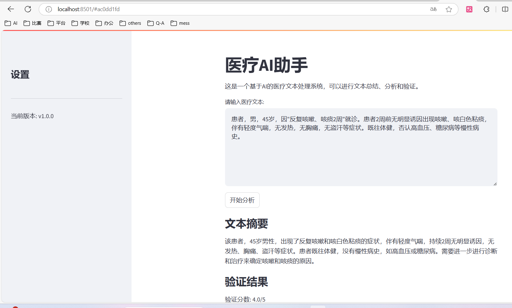
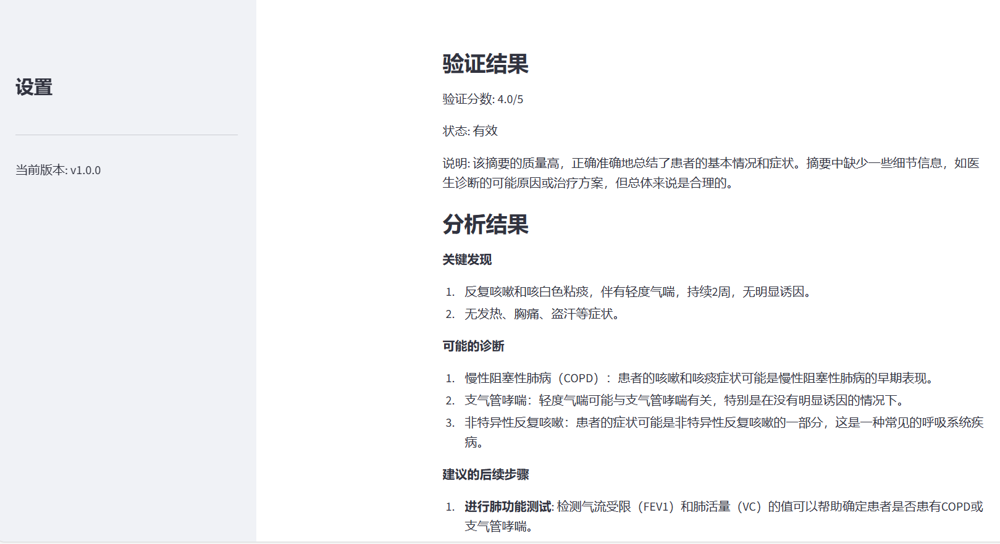
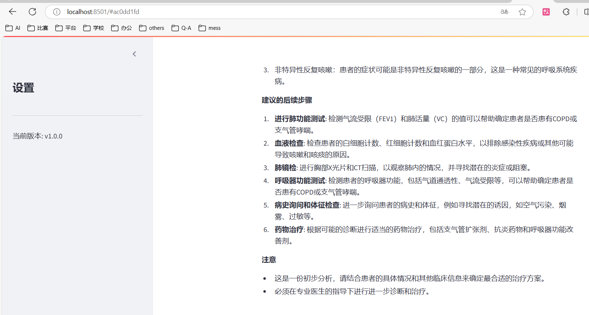

# 医疗文本智能处理系统

## 介绍
这是一个基于multi-agent架构的医疗文本处理系统。系统使用Streamlit构建前端界面,通过Ollama平台调用llama-3.2模型,实现医疗文本的智能处理。主要包含文本摘要、研究分析和PHI(受保护健康信息)编辑等功能,并配备智能验证机制确保输出质量。

## 系统架构

### 智能体架构
* 主智能体: 负责文本摘要、内容分析和数据脱敏
* 验证智能体: 对处理结果进行质量评估和验证
* 智能体管理器: 协调各智能体工作,确保处理流程顺畅

### 技术栈
* 前端: Streamlit
* AI模型: llama-3.2:3b
* 开发语言: Python
* 异步处理: Asyncio

## 项目结构

medical_agents/

├── agents/

│ ├── base_agent.py

│ ├── main_agents.py

│ └── validator_agents.py

└── config/

│ └── logging_config.py

│ └── settings.py

├── core/

│ ├── agent_manager.py

│ └── logger.py

├── logs/

├── utils/

│ └── ollama_utils.py

│ └── text_processors.py

├── venv/

├── .env

├── app.py

├── requirements.txt

├── setup.bat

└── setup.sh


## 快速开始

### 环境要求
* Python 3.8+
* Ollama平台

### 安装步骤

1. 运行安装脚本:
    ```bash
    # Windows
    setup.bat

    # Linux/Mac
    bash setup.sh
    ```

    测试ollama是否正常工作

    ```bash
    ollama serve
    
    curl http://127.0.0.1:7878/api/generate -d "{\"model\": \"llama3.2:3b\", \"prompt\": \"Hello\"}"
    ```

2. 启动应用:
    ```bash
    streamlit run app.py
    ```

访问 `http://localhost:8501` 使用系统

## 使用示例
    ```
    患者，男，45岁，因"反复咳嗽、咳痰2周"就诊。患者2周前无明显诱因出现咳嗽、咳白色粘痰，伴有轻度气喘，无发热，无胸痛，无盗汗等症状。既往体健，否认高血压、糖尿病等慢性病史。
    ```

输入病历文本后,系统将自动:
* 生成专业摘要
* 提供诊断分析
* 进行数据脱敏
* 输出质量验证(5分制)





## 改进建议
* 可以使用高质量数据集进行微调，提高模型性能
* 构建知识图谱，提高推理能力
* 采用更复杂的模型，提高处理能力
* 增加更多功能支持
* 增加更多验证机制

## 开源协议
MIT License

## 联系方式
[miouluo](mailto:miouluo24@gmail.com)

## 感谢
感谢Ollama平台提供的模型支持

感谢Streamlit平台提供的界面支持


